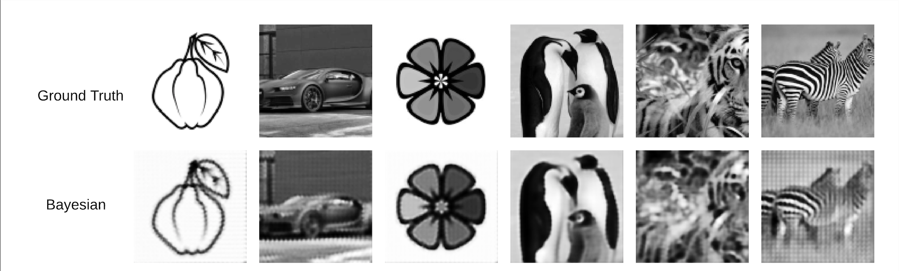

# Bayesian Super-Resolution

An implementation of the paper [Bayesian Image Super Resolution](https://papers.nips.cc/paper/2315-bayesian-image-super-resolution.pdf) by
Michael Tipping and Christopher Bishop. The method is performed in the multi-frame super-resolution paradigm - multiple low-resolution
images are used to reconstruct the high-resolution image.



## Usage

To run the script, execute the command

```bash
python3 -m resolve --image-path ./path/to/image --logdir ./path/to/logdir
```

The defaults of this script are
```
num_images =  16
seed = 42
upscale factor = 4
```

## Implementation Issues

1. Border cases are not handled correctly in the script
2. The above causes blocking artifacts shown evident in the image of the zebra
3. Due to computational requirements, only images of size of roughly 100 x 100 can be super-resolved in a
reasonable amount of time. At around 200 x 200 OOM errors are likely
4. Owing to the above, images are automatically resized to 100 x 100 and low-resolution images are generated of
size 25 x 25. Low-resolution images of this size cause a loss of high frequency information. This causes the ringing
artifacts observed in the image of the apple and car